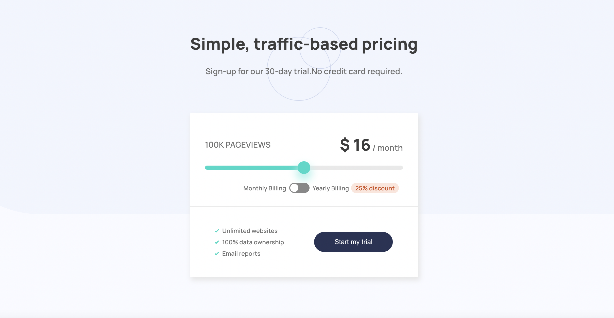
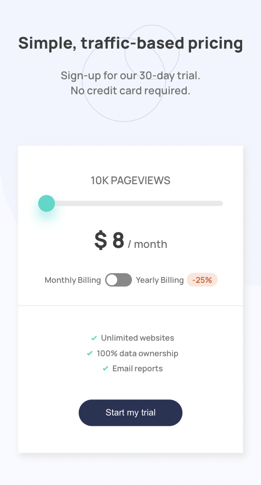

<h1 align="center"> InteractivePriceComponent </h1>

<p align="center">This is an Interactive pricing component challenge on <a href="https://www.frontendmentor.io/challenges/interactive-pricing-component-t0m8PIyY8">Frontend Mentor</a>.
</p>

## Overview
### The challenge, users are able to:

- View the optimal layout for the app depending on their device's screen size
- Use the slider and toggle to see prices for different page view numbers

### App Screenshot

<h4 align="center">Desktop</h4>
<p align="center" width="100%">
  
</p>
<h4 align="center">Mobile</h4>
<p align="center" width="100%">
  
</p>

### App Links

- Live Site URL: [InteractivePriceComponent](https://anilahsu.github.io/InteractivePriceComponent/)


## Useage

- Install all modules listed as dependencies in package.json.

```shell
npm i
```` 

- Runs the app in the development mode. Open http://localhost:3000 to view it in the browser.
```shell
npm start
```` 

## Tech Stacks

- Semantic HTML5 markup
- CSS custom properties
- Mobile first workflow
- [React](https://reactjs.org/) - JS library
